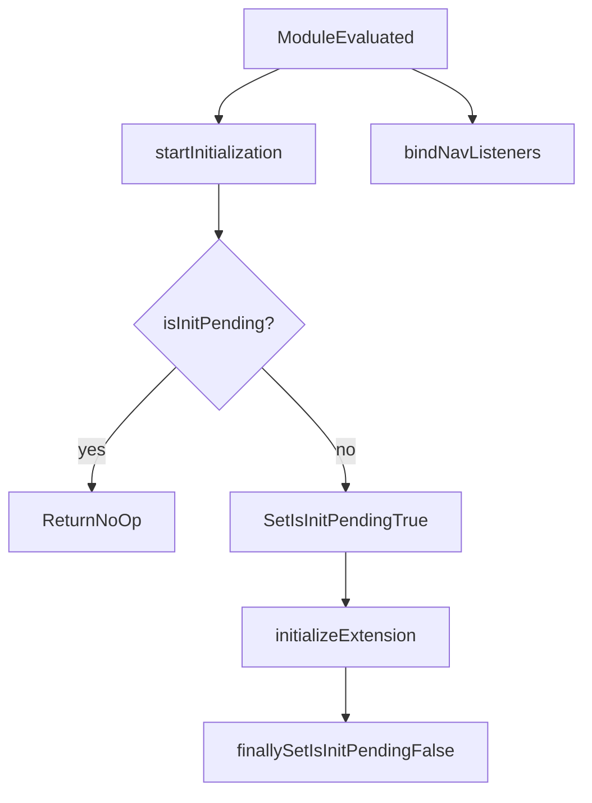
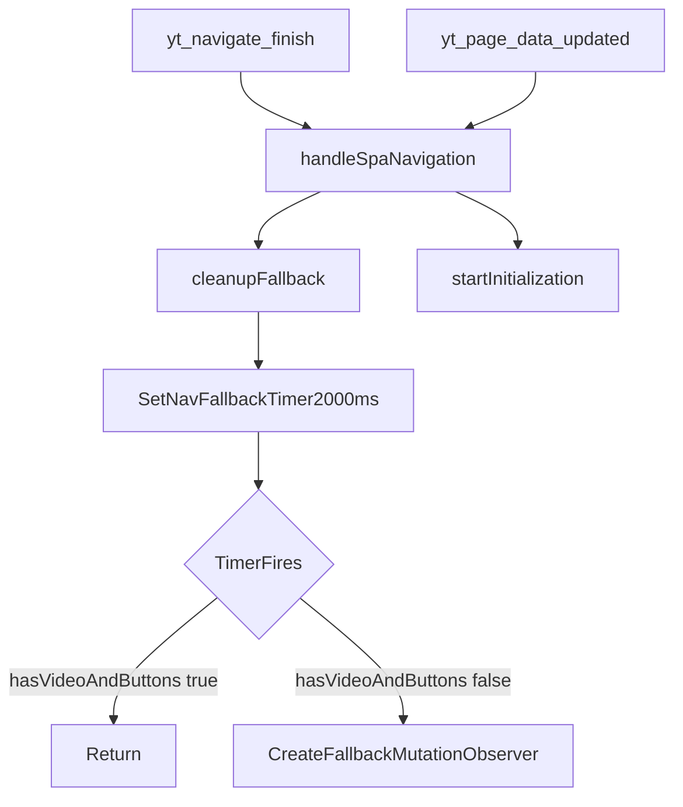
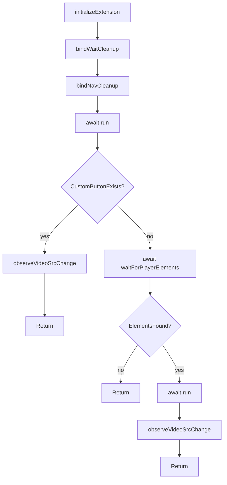
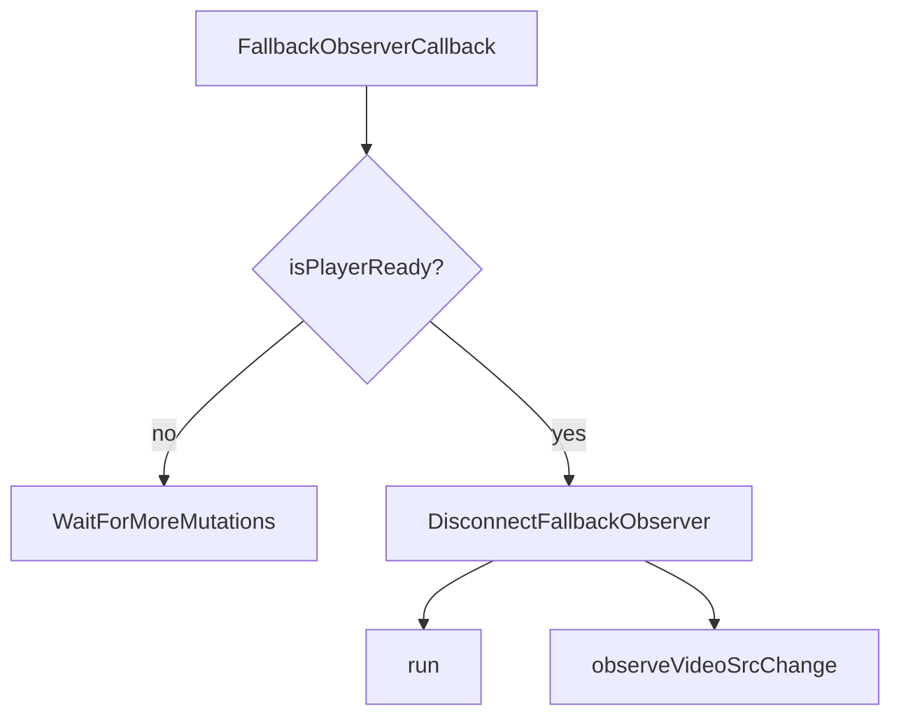
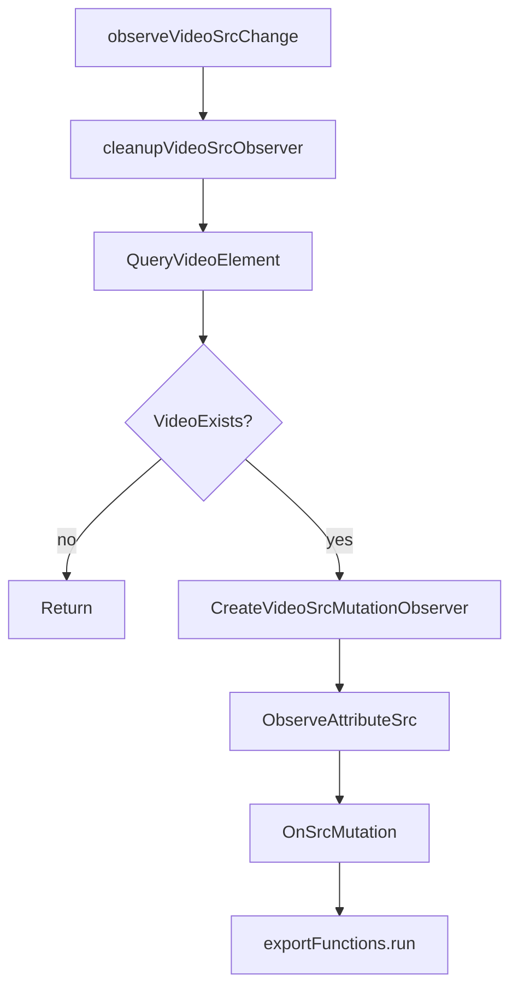
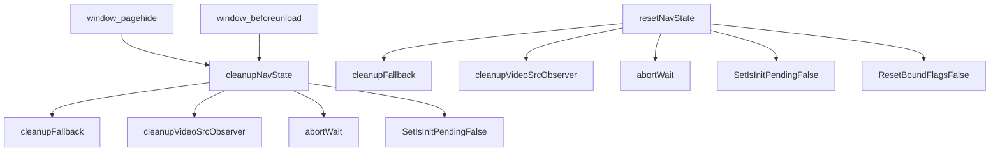
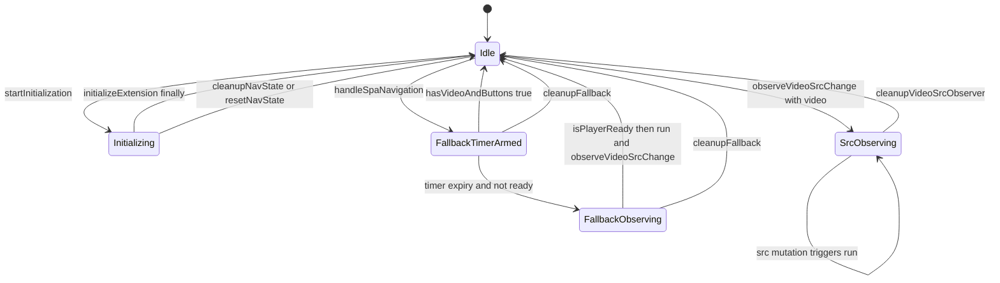
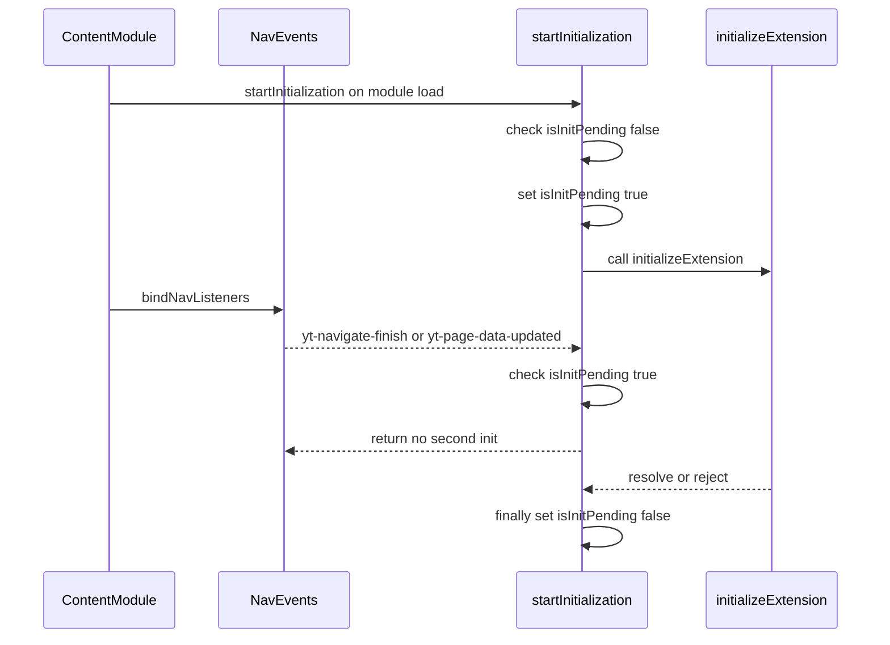
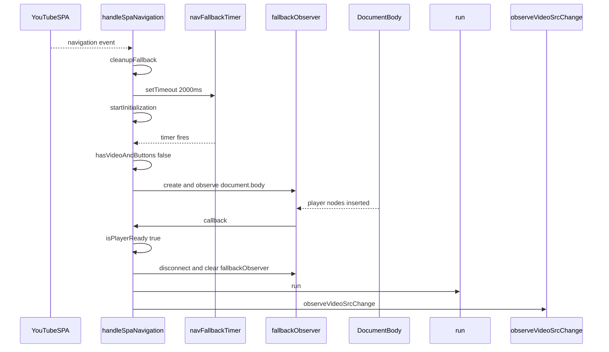

# Content Trigger Flows (`src/content/content.ts`)

This document maps the trigger paths in the content script: startup init, SPA navigation, fallback recovery, `src` observer behavior, and reset/cleanup.

## 1) Module load startup flow

## 2) SPA navigation trigger flow

`yt-navigate-finish` and `yt-page-data-updated` both call `handleSpaNavigation()`.

## 3) `initializeExtension()` decision tree

## 4) Fallback observer recovery path

This covers delayed player appearance after SPA navigation.

## 5) Video `src` observer lifecycle

## 6) Cleanup and reset paths

## 7) State-focused overview

## 8) Sequence: startup and early SPA event

This sequence shows how the guarded init prevents double initialization if a YouTube SPA event arrives while startup init is still running.

## 9) Sequence: fallback timer and observer recovery

This sequence shows late player availability after SPA navigation and how fallback attaches src observation.

