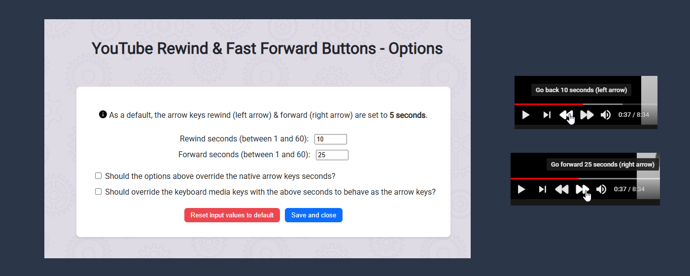
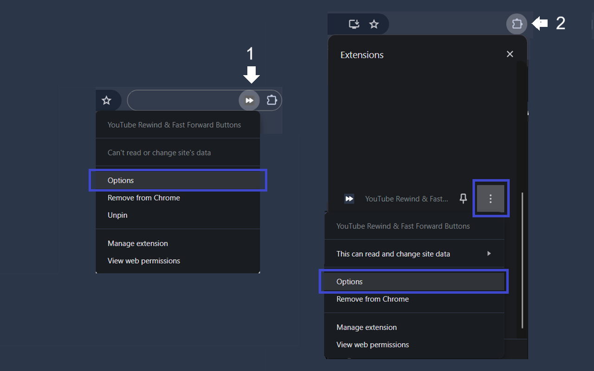
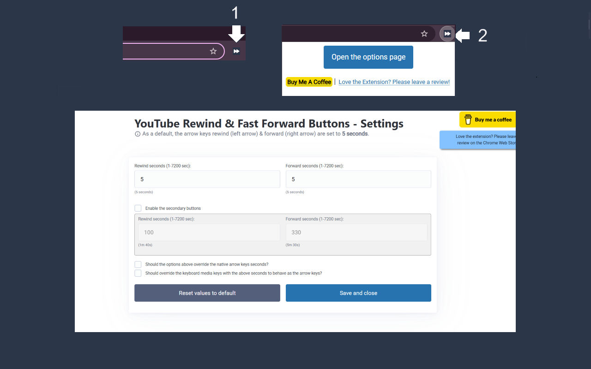

# YouTube Rewind & Fast Forward Buttons

Enhance your YouTube experience with the _Rewind & Fast Forward Chrome_ extension. This tool adds dedicated buttons for rewinding and fast forwarding the video.

### Features:

1. Customizable Time Skips:
Choose the skip duration for each button individually, with up to four customizable buttons.

2. Arrow Key Override:
Decide whether to synchronize arrow keys with the extension buttons' seconds. (Default: No override)

3. Media Key Integration:
Optimize control by mapping the keyboard media keys to mirror the extension buttons' behavior.

### How to Access the Options Page:
1. If you've pinned the extension, click the extension icon and then click the "Open the option page" button.
2. If you haven't pinned it, click the Chrome extension icon, and you will have 2 options:
   1. Click the three dots near the "YouTube Rewind & Fast Forward Buttons" extension, and select "Options".
   2. Click on the extension name, then click on the "Open the option page" button.

(Refer to the pictures for guidance.)

