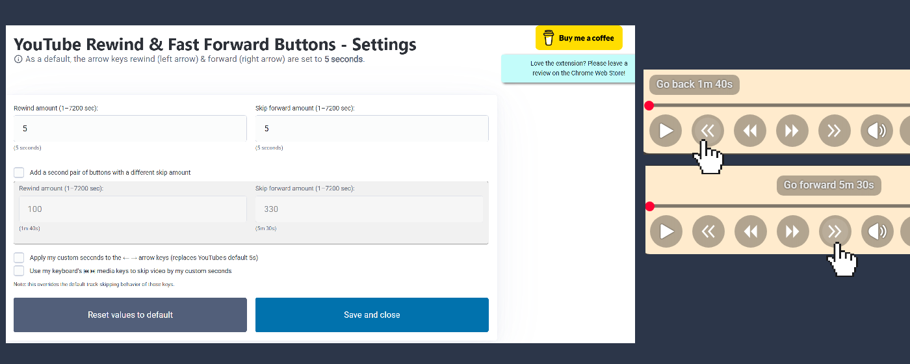
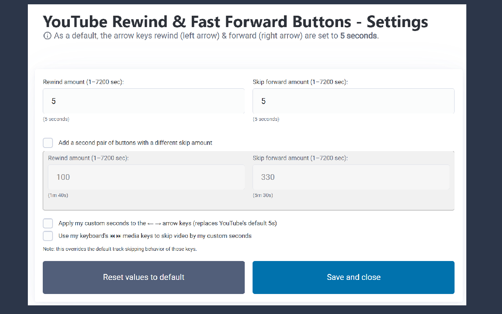
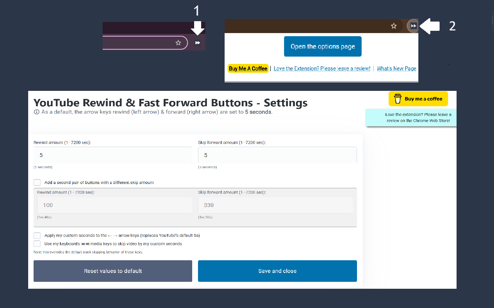

# YouTube Rewind & Fast Forward Buttons

Enhance your YouTube experience with the _Rewind & Fast Forward Chrome_ extension. This tool adds dedicated buttons for rewinding and fast-forwarding videos.

### Features:

1. **Customizable Time Skips** — Choose the skip duration for each button individually, with up to four customizable buttons.

2. **Arrow Key Override** — Choose whether to synchronize the Left and Right arrow keys with your configured skip durations. (Default: No override)

3. **Media Key Integration** — Map your keyboard's media keys (Previous/Next track) to use the same skip durations as the extension buttons.

### How to Access the Options Page

1. If you've pinned the extension, click the extension icon and then click "Open the options page".
2. If you haven't pinned it, click the Chrome extensions icon; you'll have two options:
   - Click the three dots next to "YouTube Rewind & Fast Forward Buttons" and select **Options**.
   - Click the extension name, then click "Open the options page".

See the screenshots below for guidance.

